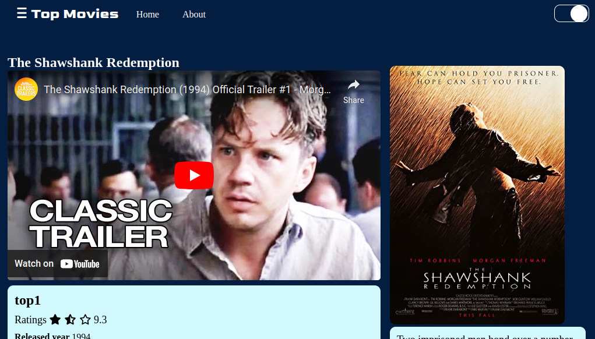

# Project Name

This is a web application built with Node.js and Express.js that displays a list of movies and their details.

## Screenshots

### Home Page

### Movie Detail Page

## Installation

1. Clone the repository.
2. Run `npm install` to install the dependencies.
3. Run `npm start` to start the server.
4. Open your browser and go to `http://localhost:5000`.

## Features

- Displays a list of movies with their posters and titles.
- Allows the user to view details of a specific movie, such as the genre, director, release year, and description.
- Provides a trailer for each movie.
- Responsive design that works on desktop .

## Technologies Used

- Node.js
- Express.js
- SQLite
- EJS
- CSS

## Credits

The data for the movies was taken from [IMDb Top 250](https://www.imdb.com/chart/top/).

## License

This project is licensed under the MIT License.
